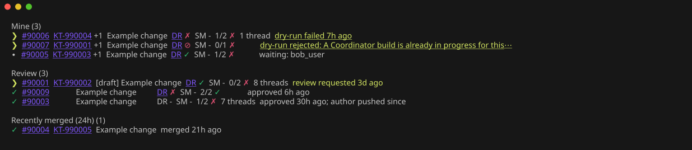
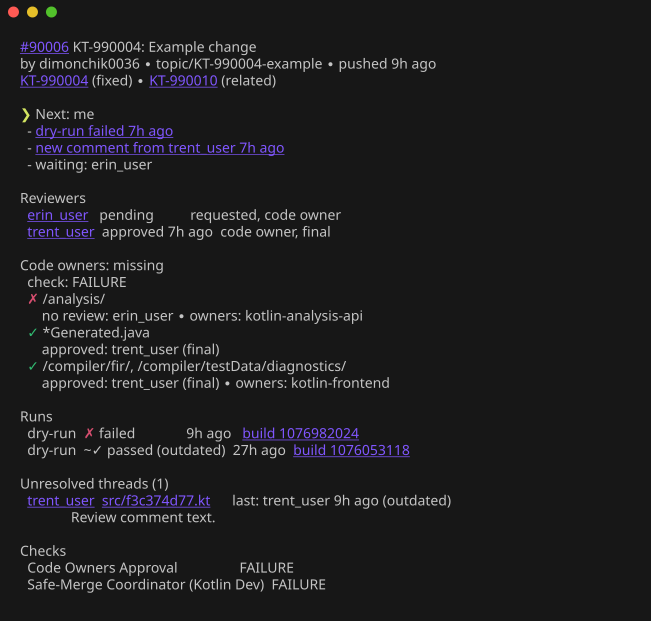

# gh-kotlin-prs

A `gh` extension that shows the open [JetBrains/kotlin](https://github.com/JetBrains/kotlin) PRs you're involved in:
their dry-run / safe-merge status, where the review stands, and who has the next move. See [SPEC.md](SPEC.md).





The screenshots use the anonymized test fixtures (`scripts/screenshots.sh`).

## Usage

```sh
gh kotlin-prs                 # same as `list` for now
gh kotlin-prs list            # Mine, Review, Team requests, Recently merged (24h)
gh kotlin-prs list --mine     # only your PRs (and the recently merged ones)
gh kotlin-prs list --review --waiting-on-me
gh kotlin-prs list --all      # also reviews not waiting on you and drafts
gh kotlin-prs list --no-teams --no-merged
gh kotlin-prs list --format json   # the model with "version": 1
gh kotlin-prs show <number>   # reviewers, code owners, runs, threads and all reasons
```

`--debug` prints the GraphQL cost of each request to stderr.

On a terminal, PR numbers, issue IDs, the DR / SM cells and the reasons are clickable (OSC 8 hyperlinks): a reason
opens its build, the bot's reply, the review or the thread; `show` also links builds (as a short `build <id>`), logins and threads.
`--hyperlinks auto|always|never` (config `hyperlinks`) overrides that; JSON never has links.

A row reads:

```
❯  #90005  KT-990003 +1  Example change  DR ✓  SM -  0/2 ✗  2 threads  changes requested by alice_user
```

The first column is whose move it is, then the issue, the latest dry-run (`DR`) and safe-merge (`SM`), approvals out
of the people reviewing with the code-owners verdict, unresolved threads and the main reason. `show` lists every reason.

Issues come from `^KT-123 Fixed` / `^KT-123 Obsolete` / `^KT-123` trailers in the PR's commit messages, then the branch
name and the title. The row shows the primary one (fixed first) and how many more: `KT-990003 +1`; `show` lists them all.

Review lists only PRs where your review is requested and you haven't answered it yet; the rest is counted in a
`+4 reviews not waiting on you, 1 draft (--all)` line and shown with `--all`.

Symbols are single-width text characters, so the columns line up in any terminal (`--help` prints the same legend):

```
  next move:   ❯ yours, ⟳ CI, ∙ reviewers or author, ✓ done
  DR / SM:     - none, ? requested, ! no response, ⋯ accepted, ⟳ running, ✓ passed, ✗ failed, ⊘ rejected, ⨯ cancelled, ~ prefix: older than the last push
  approvals:   A/R approved/reviewing, ✓ code owners ok, ✗ code owners missing, ? unknown
```

With `--icons ascii` (or `icons: ascii` in the config):

```
  next move:   ! yours, > CI, . reviewers or author, + done
  DR / SM:     - none, ? requested, ! no response, ^ accepted, > running, + passed, x failed, / rejected, c cancelled, ~ prefix: older than the last push
  approvals:   A/R approved/reviewing, + code owners ok, x code owners missing, ? unknown
```

`show` spells out the code-owner bot's marks: `❌` → "no review" (or "no reviewer assigned"), `🔄` → "commented, review
not re-requested", `🔴` → "changes requested", `✅` → "approved", and `🔒` / `⏳` → "(final)" / "(unavailable)" after
the login.

Exit codes: 0 ok, 1 error, 2 bad usage.

## Config

`~/.config/gh-kotlin-prs/config.yml` (or `$XDG_CONFIG_HOME/gh-kotlin-prs/config.yml`); `--config PATH` or
`$GH_KOTLIN_PRS_CONFIG` point elsewhere. Every key is optional:

```sh
gh kotlin-prs config          # the effective config, each value marked default, file or flag
gh kotlin-prs config path     # the file in use
gh kotlin-prs config init     # write the file with every key and its default, commented out (--force to overwrite)
```


```yaml
repo: JetBrains/kotlin
bots: [KotlinBuild, kotlin-safemerge, kodee-bot]
gateBot: KotlinBuild
ownersBot: kotlin-safemerge
teams: []                 # only show team requests to these teams; empty means all
refresh: 3m
requestedTimeout: 10m
icons: unicode            # or ascii
issueProjects: [KT, KTIJ, KTI]   # issue IDs recognized in commit trailers, branch names and titles
issueURL: https://youtrack.jetbrains.com/issue/{id}
hyperlinks: auto          # always, never
```

## Development

Build and install the working copy in place of a release (`gh extension remove kotlin-prs` first if one is installed):

```sh
go build && gh extension install .
```

Run `scripts/check.sh` before every commit; CI runs the same script. It checks formatting, `go vet`, staticcheck and
govulncheck (pinned as tool dependencies in `go.mod`), then runs the tests the way CI does: without your gh login,
your config or the network. To run it on every commit, enable the bundled hook: `git config core.hooksPath .githooks`.

```sh
scripts/check.sh
go test ./internal/classify ./internal/render -update   # rewrite goldens (in this order), review the diff
scripts/fetch-fixtures.sh <pr-number>                    # refresh testdata/raw, adding these PRs
```

`GH_KOTLIN_PRS_DEMO=testdata/raw gh kotlin-prs list` (or `show <fixture number>`) serves the fixtures instead of
GitHub, with the fixtures' clock and viewer: no login, no network. The screenshots come from it.

`testdata/raw` holds GraphQL responses, `testdata/golden` the model JSON
and table text they produce. `scripts/fetch-fixtures.sh` refetches every fixture and passes the batch through
`scripts/anonymize`: logins become pseudonyms (alice_user, bob_user, …) except yours and the bots', human text becomes
filler, and bot comments stay verbatim apart from the logins in them. Raw responses never leave a temp dir.
PR and KT numbers, commit SHAs, merge-request ids and thread paths are fake too. The real → fake map is
`testdata/.fixture-map.json`: local, gitignored, never commit it. Without it the script can't refetch the
existing fixtures, only add new ones.
After refreshing fixtures, regenerate the goldens and review them.

## Releasing

See [RELEASING.md](RELEASING.md); user-visible changes go to [CHANGELOG.md](CHANGELOG.md).

## License

Licensed under the [Apache License 2.0](LICENSE).
